# 👋 Hi, I'm orangeboy

I'm a software engineer working on client-side development at **Tencent**, while continuously building backend, cloud-native, AI-agent, and automation systems through real-world projects and self-hosted infrastructure.

I care about reliable systems, clean boundaries, developer tools, and software that can be understood, operated, and maintained.

---

## 🧭 About Me

- 💼 Software developer at **Tencent**
- 🧩 Interested in **backend engineering**, **cloud-native systems**, **AI agents**, **DevOps**, and **system design**
- 🏠 Running a Kubernetes-based homelab with GitOps, observability, backup, media, AI, finance, and automation services
- 🛠️ Building tools around developer productivity, infrastructure, automation, and everyday workflows
- 🔍 Curious about system internals, protocols, security, reverse engineering, and runtime behavior
- 🌱 Growing toward a stronger backend / full-stack engineering path

---

## 🚀 Selected Work

### 🏠 Home Assistant & Smart Home

I build Home Assistant integrations and automations that connect real devices and everyday scenarios into a controllable local system.

- [ha-jd-smart](https://github.com/orangeboyChen/ha-jd-smart) — Home Assistant custom integration for JD Smart / JD Xiaojia air conditioners
- [ha-vanward-water-heater](https://github.com/orangeboyChen/ha-vanward-water-heater) — Home Assistant custom integration for Vanward water heaters
- [ha-meituan-delivery](https://github.com/orangeboyChen/ha-meituan-delivery) — work-in-progress Home Assistant integration around delivery-rider location automation
- [ha-lobehub](https://github.com/orangeboyChen/ha-lobehub) — Home Assistant custom integration for LobeHub agents and conversations

Focus: custom integrations, captured app APIs, device entities, token refresh, and real-world smart-home automation.

### 🤖 AI Agents, MCP & Model Gateway Tooling

I explore how AI agents, MCP servers, and model-gateway tools can connect local services, personal data, and automation workflows with clear operational boundaries.

- [portfolio-insight-mcp](https://github.com/orangeboyChen/portfolio-insight-mcp) — connects Wealthfolio portfolio data to AI agents for analysis and daily reports
- [wealthfolio-connect-self-hosted](https://github.com/orangeboyChen/wealthfolio-connect-self-hosted) — self-hosted companion service for Wealthfolio sync scenarios
- [notification-mcp](https://github.com/orangeboyChen/notification-mcp) — exposes Telegram, Email, and Bark notifications as controlled MCP tools
- [new-api-langfuse-proxy](https://github.com/orangeboyChen/new-api-langfuse-proxy) — adds Langfuse telemetry around New API traffic
- [new-api-mobile](https://github.com/orangeboyChen/new-api-mobile) — work-in-progress mobile client experiments for New API management flows

Focus: MCP server design, AI-accessible tools, model gateway observability, finance automation, notification workflows, and safe boundaries around personal services.

### 🛠️ Developer Tools & CLI

I enjoy building command-line tools that turn messy workflows into reproducible, validated, and maintainable processes.

- [mcmod-cli](https://github.com/orangeboyChen/mcmod-cli) — a work-in-progress Go CLI for Minecraft modpack specs, dependency locks, jar resolution, and build workflows

Focus: CLI design, dependency resolution, structured configuration, validation, testing, and build pipeline design.

### 🌐 Full-Stack & Campus Services

I have also built product-oriented applications that combine frontend, backend, service integration, and real user scenarios.

- [whu-ham](https://github.com/whu-ham) — Wuhan University life assistant for timetable, grades, sports venue reservation, and library reservation workflows

Focus: frontend/backend integration, campus service aggregation, workflow automation, and product-style application development.

---

## 🛠️ Tech Stack

### Languages

### Backend, Frontend & Mobile

### Infrastructure & Tools

---

## 📌 Interests

- Backend engineering
- Cloud-native infrastructure
- Kubernetes & GitOps
- DevOps and observability
- AI agents and MCP tools
- Model gateway tooling and observability
- Developer tooling
- Smart-home automation
- Security and cryptography
- System design
- Cross-platform development

---

## 📈 GitHub Statistics

  
  

---

## 📊 Activity

  

---

## 📫 Contact

If you want to discuss software engineering, infrastructure, automation, AI agents, or interesting tools, feel free to reach me through:

- GitHub Issues: [orangeboyChen/orangeboyChen](https://github.com/orangeboyChen/orangeboyChen/issues)
- Email: available on my GitHub profile

---

  Building small, reliable things with care. 🧡

